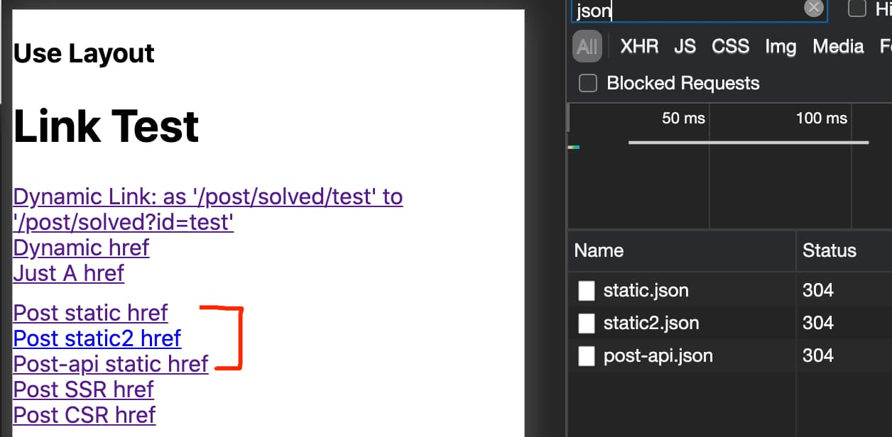
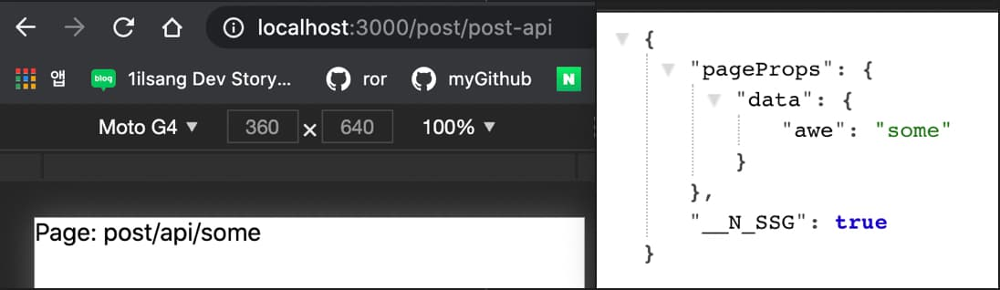

# Next.js 에서 데이터 가져오기

이전의 [페이지 문서](pages.md)에서 사전 렌더링을 위해 데이터를 가져오는 두 가지 방법으로 **Static Generation**과 **ServerSide Rendering**이 있다고 했다.

이번 장에서는 각 렌더링에서 사용할 수 있는 함수를 알아보자.

1. `getStaticProps`(Static Generation): 빌드시 데이터를 가져온다.
2. `getStaticPaths`(Static Generation): 사전 렌더링 할 **동적 경로**를 설정한다.
3. `getServerSideProps`(Server Side Rendering): 모든 요청에 데이터를 가져온다.
4. `fetch`, `useSWR`(Client Side): 클라이언트 측에서 데이터를 가져오는 방법.

# getStaticProps

```javascript
export async function getStaticProps(context) {
  return {
    props: {}, // will be passed to the page component as props
  }
}
```

`getStaticProps`는 정적 페이지 빌드시에 사용되며 Next.js 가 주는 값을 `context`에 담아오고 외부 데이터를 요청하거나 재가공하여 리액트에 내려주게 된다.(`props`)

- 개발모드에선 모든 요청에 실행되지만 프로덕션 모드에선 **build 타임에 한 번만 실행**된다.
- 브라우저용 JS 번들에도 포함되지 않으므로 디비 쿼리 같은 코드를 작성해도 된다.

`context` 의 변수들

- `params`: [다이나믹 라우트](https://github.com/Road-of-CODEr/we-hate-js/blob/master/Front-End/Next.js/basicFeatures/pages.md#%EC%8B%9C%EB%82%98%EB%A6%AC%EC%98%A4-2-%ED%8E%98%EC%9D%B4%EC%A7%80-%EA%B2%BD%EB%A1%9C%EA%B0%80-%EC%99%B8%EB%B6%80-%EB%8D%B0%EC%9D%B4%ED%84%B0%EC%97%90-%EC%9D%98%EC%A1%B4%EC%A0%81%EC%9D%B8-%EA%B2%BD%EC%9A%B0)를 사용할 때 route 파라미터들을 가져올 수 있다.(예: `[id].js` -> `{ id: ... }`)

### example: Preview Mode

```javascript
// pages/api/...
export default function handler(req, res) {
  // ...
  res.setPreviewData({ ... });
  // ...
}
```

```javascript
export async function getStaticProps(context) {
  const res = await fetch(`https://.../${context.preview ? 'preview' : ''}`)
  // ...
}
```

- `preview`: [Preview 모드](https://nextjs.org/docs/advanced-features/preview-mode)일 경우 `true` 가 넘어오며 아닐 경우에는 `undefined` 가 된다.([예시](https://www.datocms.com/blog/live-preview-with-next-js))
- `previewData`: Preview 모드에서 정의한 `setPreviewData` 데이터가 넘어온다.
- `locale`: 활성화 된 경우 locale 정보를 가져온다.(`ko`, `en` 등의 언어 설정)
- `locales`: 제공해줄 수 있는 언어 셋을 가져온다.
- `defaultLocale`: 설정된 기본 언어 locale 을 가져온다.

`return` 하는 값들(props 를 제외하면 모두 optional 이다.)

- `props`: 페이지 컴포넌트에 넘겨줄 [직렬화 가능](https://velog.io/@raram2/serialization)한 데이터(예: JSON)
- [`revalidate`](#증분-정적-재생성incremental-static-regeneration): 페이지 재생성이 발생할 시간(초) 설정([예시](https://github.com/chibicode/reactions/issues/1), [추가설명](https://github.com/vercel/next.js/discussions/11427))
- `notFound`: 해당 경로에 없으면 404 페이지 및 상태코드를 반환할지 여부(true 면 404 페이지로 간다)

```javascript
export async function getStaticProps(context) {
  const res = await fetch(`https://.../data`)
  const data = await res.json()

  if (!data) {
    return {
      notFound: true,
    }
  }

  return {
    props: {}, // will be passed to the page component as props
  }
}
```

> 만약 `fallback: false` 일 경우 `notFound` 는 불필요 하다. 사전 렌더링에서 모두 처리하기 때문

- `redirect`: 내/외부의 리소스로 리다이렉트 할 수 있는 인자. 

```javascript
export async function getStaticProps(context) {
  const res = await fetch(`https://...`)
  const data = await res.json()

  if (!data) {
    return {
      redirect: {
        destination: '/',
        permanent: false, // statusCode 로 응답해도 된다.
        // statusCode 는 커스텀 상태 코드를 사용하는 오래된 클라이언트를 위해 적용해 줄 수 있다.
      },
    }
  }

  return {
    props: {}, // will be passed to the page component as props
  }
}
```

> 현재 빌드 타임에 리다이랙트는 허용되지 않음. 만약 빌드타임에 리다이랙트 위치를 알아야 한다면 [`next.config.js`에 추가](https://nextjs.org/docs/api-reference/next.config.js/redirects)해 주어야 한다.

`getStaticProps` 는 client-side 의 `bundle`에 포함되지 않으므로 최상위 범위의 모듈을 가져올 수 있다.([예시 보기](https://next-code-elimination.now.sh/))

이는 **Server Side 코드를 바로 사용할 수 있다는 뜻**이다.(데이터베이스에 접근하는 등)

이때 API Route(`pages/api/...`) 를 사용한다면 `fetch` 로 가져올 수 없다. 따로 함수형태로 만들어 주어야 한다.([Discussion](https://github.com/vercel/next.js/discussions/16068))

### example: API Route for getStaticProps

```javascript
// pages/api/post.js
const getData = async () => Promise.resolve({ awe: 'some' });

const handler = async (req, res) => {
	const data = await getData();
	res.json({ data });
};

export const getAwesomeData = async () => {
	return await getData();
};

export default handler;
```

```javascript
// pages/post-api.js
import api, { getAwesomeData } from './api/post';

const PostApi = ({ data }) => {
	console.log('postApi Client', data);

	return (
		<>
			<div>Page: post/api/{data.awe}</div>
		</>
	);
};

export const getStaticProps = async () => {
	// Direct fetch call will be throw Error!
	// const res = await fetch('http://localhost:3000/api/post');
	const data = await getAwesomeData();
	console.log('GET DATA!', data, data?.awe);

	return {
		props: {
			data,
		},
	};
};

export default PostApi;
```

## 언제 `getStaticProps`를 사용해 주어야 할까?

- 페이지를 렌더링 할 때 필요한 데이터를 사용자의 요청보다 앞선 빌드 타임에서 사용할 수 있는 경우
- 데이터가 [Headless CMS](https://simsimjae.medium.com/headless-cms%EB%9E%80-49569dc86daa) 에서 제공될 때
- 유저 상관 없이 퍼블릭하게 캐시될 수 있는 데이터일 때
- 페이지가 반드시 사전 렌더링 되어야(for SEO) 하며 빨라야 하는 경우

`getStaticProps`는 HTML 과 JSON 파일로 내려주기 때문에 CDN 에 캐시해 높은 성능을 보여줄 수 있다.


## 증분 정적 재생성(Incremental Static Regeneration)

- [Demo](https://reactions-demo.now.sh/)

`getStaticProps`를 사용하면 정적 컨텐츠 또한 동적일수 있으므로 동적 콘텐츠에 대한 의존을 멈출 필요가 없다. 증분 정적 재생성을 사용하면 백그라운드에서 기존의 페이지를 다시 렌더링하여 페이지를 업데이트 할 수 있다.

[Stale-While-Revalidate](https://tools.ietf.org/html/rfc5861) 헤더를 사용해 서비스 중단 없이 백그라운드에서 재생성하여 완료된 이후 배포한다.([SWR 설명 더 보기](https://vercel.com/docs/edge-network/caching#stale-while-revalidate))

```javascript
function Blog({ posts }) {
  return (
    <ul>
      {posts.map((post) => (
        <li>{post.title}</li>
      ))}
    </ul>
  )
}

export async function getStaticProps() {
  const res = await fetch('https://.../posts')
  const posts = await res.json()

  return {
    props: {
      posts,
    },
    // 요청이 들어오면 매초마다 Next.js 가 페이지를 다시 생성하려고 할 것이다.
    revalidate: 1, // 기준: 초
  }
}

export default Blog
```

위와 같이 코드를 작성했다면 해당 게시물은 초당 한 번씩 재검증 된다. 만약 새로운 게시물을 추가한다면 ***앱을 다시 만들거나 배포를 다시 하지 않아도 즉시 사용*** 할 수 있다.

이는 `fallback:true` 와 완벽하게 통한다. 항상 최신의 게시물을 가질 수 있게 되었으므로 많은 게시물을 추가하거나 자주 업데이트 하든 상관 없이 정적 페이지를 만들 수 있게 되었다.(다이나믹 페이지로 페이지가 생성될 때마다 최신의 데이터를 사용할 수 있다는 뜻)

## Static content at scale

기존의 전통적인 SSR과 달리 증분 정적 재생성을 사용하면 정적 이점을 그대로 사용할 수 있다.

- latency 에 스파크가 일어나지 않는다
   - 렌더링에 따른 순단 현상이 없으므로 페이지가 지속적으로 빠르게 제공된다.
- 절대 오프라인 상태로 되지 않는다.
   - 백그라운드에서 페이지 재생성이 실패해도 이전 페이지는 그대로 유지되고 있기 때문
- 백엔드 및 데이터베이스 콜이 낮다.
   - 페이지들은 최대 한 번에 동시에 재계산된다.

[Incremental Static Regeneration 초기 모델과 의견들 더 읽어보기](https://github.com/vercel/next.js/discussions/11552)

## getStaticProps의 기술적 세부 사항

### 빌드시에만 실행됨

`getStaticProps`는 빌드 시간에 실행되기 때문에 query 파라미터나 HTTP headers 등 유저의 요청시에만 사용할 수 있는 값은 받을수 없다.

### 서버사이드 코드를 바로 작성

`getStaticProps`는 오직 서버사이드에서만 실행된다. 이는 절대 클라이언트 사이드에서 실행되지 않음을 뜻한다.(심지어 브라우저를 위한 JS 번들 파일에도 포함되지 않는다) 이것은 DB 쿼리 같은 민감 코드를 바로 작성해도 안전하다는 뜻이다.

`getStaticProps`에서 API 라우트(`pages/api`)를 `fetch` 로 사용할 수 없다. 그대신 [위](#example-api-route-for-getstaticprops)에서 설명한 것처럼 함수로 바로 사용하라.

### HTML 과 JSON 을 모두 정적으로 생성

빌드시 `getStaticProps`가 포함된 페이지가 사전 렌더링 될 경우 페이지 HTML 외에 `getStaticProps`를 실행한 결과를 포함한 `fileName.json` 파일을 생성한다.

이 JSON 파일은 `next/link` 혹은 `next/router` 를 통한 **클라이언트 사이드 라우팅**에서 사용된다.

`getStaticProps`를 사용하여 미리 랜더링된 페이지에 라우팅 접근을 하게 될 경우 Next.js 는 이 JSON 파일을(`next/link or router` 가 사용되는 페이지에 미리 생성되어 있음) 사용해 페이지를 그린다.



만약 `next/link` or `next/router` 를 사용해 Static Generation 페이지에 접근할 경우, 해당 페이지에서 위의 스샷과 같이 JSON 파일을 가지고 있게 된다.



따라서 해당 Static Generation 페이지에 접근할 경우 바로 JSON 파일을 사용해 데이터를 보여줄 수 있다.

### page 에서만 사용할 수 있음

`getStaticProps` 는 컴포넌트에서 사용할 수 없다. 오직 `pages` 밑의 page 들만 사용 가능하다.

그 이유는 리액트가 그려지기 이전에 페이지가 모든 데이터를 들고 있어야 하기 때문이다.

또한 `export async function getStaticProps() { ... }` 혹은 `export const getStaticProps = async () => { ... }` 의 형태로 사용해야 한다. 만약 페이지 컴포넌트의 `property` 로 `getStaticProps`를 추가하면 정상적으로 동작하지 않을 것이다.

### Development 환경에선 모든 요청에 getStaticProps 가 실행된다.

`next dev` 실행 혹은 커스텀 서버에서 `next({ dev: true })` 일 경우 모든 요청마다 `getStaticProps`가 실행된다.

실제 환경을 테스트 해보고 싶다면 `next build && next start(or node custom-server.js)` 를 해주어야 한다.

### Preview Mode

경우에 따라 일시적으로 정적 생성을 우회하여 빌드 대신 요청마다 페이지를 렌더링 할 수도 있다.

예를 들자면 Headless CMS 를 사용할 때 작업물을 발행하기 전 미리보기를 원하는 경우가 있을 수 있다.

이때 [Preview Mode](#example-preview-mode) 를 사용하여 처리해 줄 수 있다.

# getStaticPaths