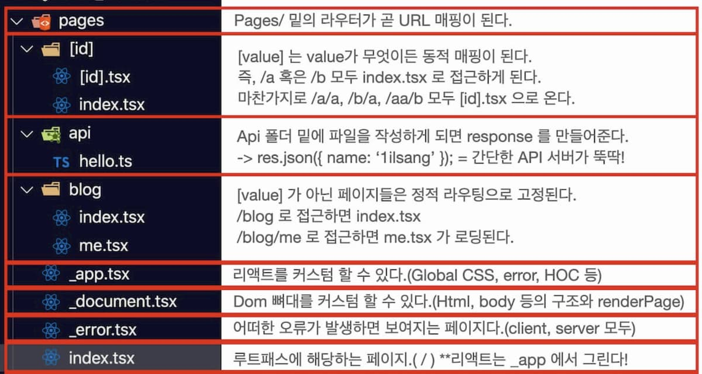

# Page



Pages 아래의 `.js`, `.jsx`, `.ts`, `.tsx` 파일들은 파일 이름에 따른 URL 경로와 매핑된다.

```javascript
// pages/about.js
function About() {
  return <div>About</div>
}
export default About
```

위와 같이 `pages` 밑에 `about.js` 파일이 존재한다면 `${domain}:${port}/about` 으로 접근시 해당 컴포넌트를 렌더링 하게 된다.

## 사전 렌더링

기본적으로 Next.js 는 모든 페이지를 **미리 렌더링** 한다. 즉 기존의 React(CSR) 방식과 달리 각 페이지에 대해 미리 HTML 을 생성해 내려준다.

이는 더 나은 성능(리액트가 페이지에 그리는 시간을 줄임)과 SEO를 가져올 수 있다.

생성 된 각 HTML 은 해당 페이지에 필요한 최소한의 JavaScript 코드와 연결된다.

### 사전 렌더링(Pre-rendering)의 두 가지 형태

Next.js 에는 `정적 생성(Static Generation)` 및 `서버 사이드 렌더링(Server Side Rendering)` 두 가지 형태의 사전 렌더링이 존재한다.

두 형태의 차이는 해당 페이지의 ***HTML 생성 시점***이다.

- 정적 생성: 빌드시 HTML이 생성되며 각 요청에 재사용된다.
- 서버 사이드 렌더링: 각 요청에 대한 HTML이 생성된다.

Next.js 는 각 페이지에 사용할 사전 렌더링 양식을 선택할 수 있다.

정적 생성을 성능상의 이점(CDN 캐시, 렌더링 시간 절약 등)으로 추천하지만 경우에 따라 서버 사이드 렌더링만 가능할 수 있다.

## 정적 생성

페이지가 정적 생성을 사용하는 경우 HTML은 **빌드시**(`next build`) 생성된다. 이 HTML 은 각 요청에서 재사용 되며 CDN 에 캐시 될 수 있다.

### 데이터가 없는 정적 생성

```javascript
// pages/about.js
function About() {
  return <div>About</div>
}
export default About
```

위의 코드에서 외부 데이터에 의존적인 부분이 없다. 이 경우 빌드시 단일 HTML 파일을 생성한다.

### 데이터를 사용한 정적 생성

일부 페이지는 사전 렌더링을 위해 외부 데이터를 가져와야 한다. 두 가지 시나리오가 있으며 하나 혹은 둘 다 사용될 수 있다.

1. **콘텐츠**가 외부 데이터에 종속적인 경우: `getStaticProps`
2. **경로**가 외부 데이터에 종속적인 경우: `getStaticPaths`(보통 `getStaticProps`와 함께 씀)

#### 시나리오 1. 페이지 콘텐츠가 외부 데이터에 종속적인 경우

```javascript
// TODO: Need to fetch `posts` (by calling some API endpoint)
//       before this page can be pre-rendered.
function Blog({ posts }) {
  return (
    <ul>
      {posts.map((post) => (
        <li>{post.title}</li>
      ))}
    </ul>
  )
}

export default Blog
```

`posts` 를 map 으로 돌리고 있기 때문에 사전 렌더링을 하려면 해당 데이터가 필요한 상황이다. 이때 `getStaticProps`를 사용하면 된다.

```javascript
function Blog({ posts }) {
  // Render posts...
}

// 빌드 타임에서 실행되는 함수(이후 실행되지 않음)
export async function getStaticProps() {
  // 외부 API 를 호출한다.
  const res = await fetch('https://.../posts')
  const posts = await res.json()

  // 이렇게 데이터를 내려주면 위의 Blog 함수에서 posts 데이터를 빌드 시점에서 사용할 수 있다.
  return {
    props: {
      posts,
    },
  }
}

export default Blog
```

#### 시나리오 2. 페이지 경로가 외부 데이터에 의존적인 경우

Next.js 를 사용하면 **동적 경로**의 페이지를 만들 수 있다. 

예: `pages/posts/[id].js` 

이 경우 `localhost/posts/1`, `localhost/posts/2`, `localhost/posts/3` 모두 가능해진다.

이때 만약 `id` 에 따른 데이터가 달라진다고 하면(Post 의 id 마다 디비에서 다른 값을 가져오는 등의 작업) **사전에 `id` 값들을 가져와 페이지를 만들어야 한다**.

```javascript
export async function getStaticPaths() {
  const res = await fetch('https://.../posts')
  const posts = await res.json()

  // Get the paths we want to pre-render based on posts
  const paths = posts.map((post) => `/posts/${post.id}`)

  // We'll pre-render only these paths at build time.
  // { fallback: false } 를 해주면 paths 외의 것들은 404로 떨어진다.
  return { paths, fallback: false }
}
```

이렇게 사전 path 를 정하고 나면 해당 path 에 맞는 page 에 데이터를 내려줘야 한다. 이 경우 `getStaticProps`와 함께 사용하면 된다.

```javascript
function Post({ post }) {
  // Render post...
}

export async function getStaticPaths() {
  // 위와 동일
}

export async function getStaticProps({ params }) {
  // params contains the post `id`.
  // If the route is like /posts/1, then params.id is 1
  const res = await fetch(`https://.../posts/${params.id}`)
  const post = await res.json()

  // id 에 맞는 데이터를 내려준다.
  return { props: { post } }
}

export default Post
```

요약하자면, `getStaticPaths`를 통해 만들어 줘야할 동적인 페이지를 Path 를 만들고 `getStaticProps`로 해당 path 에 맞는 값들을 `props`로 내려준다고 보면 된다.

그 결과 각각의 path(`id`)에 맞는 데이터가 Post 컴포넌트에 올바르게 내려(props)간다.

### 정적 생성은 언제 사용해야 할까?

페이지를 한 번 빌드하고 CDN에서 쭉 제공할 수 있으면 정적 생성을 사용하는게 좋다. 모든 요청마다 서버에서 렌더링을 하면 훨씬 비용이 많이 들게 된다.

예시
- 마케팅 페이지
- 블로그 게시물
- 제품 목록
- 도움말 및 문서

위의 예시들만 봐도 한번 만들어지고 잘 안바뀌며, 유저에 상관없이 공적으로 보이는 페이지라는 느낌이 온다.

> 즉, 사용자의 요청에 앞서 페이지를 미리 렌더링 할 수 있는가? 를 고민해 보면 된다.(사용자에 상관없이)

만약 페이지가 자주 업데이트 되고 유저마다 보여지는 데이터가 다르다면 정적 생성은 좋은 예시가 아니다.

이 경우 기존의 CSR 혹은 SSR 에서 수행하면 된다.

## 서버 사이드 렌더링

서버 사이드 렌더링은 HTML 이 각 요청마다 렌더링된다.

페이지에 대한 렌더링은 `getServerSideProps` 가 담당하며 `getStaticProps`와 동일하지만 시점이 다르다고 이해하면 편하다.

```javascript
function Page({ data }) {
  // Render data...
}

// 모든 요청에 대해서 실행되는 함수.
export async function getServerSideProps() {
  const res = await fetch(`https://.../data`)
  const data = await res.json()

  return { props: { data } }
}

export default Page
```

`getStaticProps` 는 빌드시 한 번만 실행 되지만 `getServerSideProps`는 모든 요청에 대해서 실행 된다는 점이 매우 큰 차이다

# 요약

- 정적 생성(Static Generation): 빌드시 HTML 을 만들고 각 요청에 **재사용** 한다. 사전 렌더링이 필요할 경우 `getStaticProps`, `getStaticPath`와 함께 사용해 페이지 `Path` 및 `Data` 를 구성해 줄 수 있다. CSR 과 함께 사용하여 추가 데이터를 가져올 수도 있다.
- 서버 사이드 렌더링: **각 요청마다 HTML 이 생성**된다. 즉 모든 요청에 `getServerSideProps`가 응답한다. 서버 사이드 렌더링은 정적 생성보다 성능이 안좋기 때문에 블로그 등의 정적 페이지라면 정적 생성을 사용하는게 옳다.