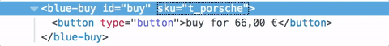

# Micro Frontend
- https://micro-frontends.org/ 를 번역한 글
- 해당 레포에 컨트리뷰션은 따로 진행중

---
**여러 팀이 각자 독립적으로 기능(features)을 제공**할 수 있게 **모던 웹 앱 구축**을 위한 기술(Techniques), 전략(strategies), 레시피(recipes)에 관한 이야기.
## Micro Frontends란 무엇인가?
**Micro Frontends**라는 용어는 2016년 말에 [ThoughtWorks Technology Radar](https://www.thoughtworks.com/radar/techniques/micro-frontends)에서 처음 등장했다. 그것은 마이크로 서비스의 개념을 프론트엔드 세계로 확장한다. 현재 추세는 기능이 풍부하고 파워풀한 브라우저 애플리케이션, 즉 마이크로 서비스 아키텍처 위에 단일 페이지 앱(SPA)을 구축하는 것이다. 시간이 지남에 따라, 프론트엔드는 여러 분리된 팀에 의해 개발되는 경우가 자주 생기다보니 프론트엔드 계층은 커지고 유지 관리가 더 어려워지고 있다. 이것을 [프론트엔드 모노리스(Frontend Monolith)](https://www.youtube.com/watch?v=pU1gXA0rfwc) 라고 부른다.

Micro Frontends는 개별 팀들이 소유하고있는 웹사이트나 웹앱을 하나의 기능으로 보고, **그 기능(features)을 구성(composition)** 하자는 방식의 아이디어 이다. 각 팀 별로 팀에서 담당하는 뚜렷한 **비즈니스 영역** 혹은  **미션**이 있을 것이다. 각 팀내 에서는 데이터베이스에서 사용자 인터페이스에 이르기까지 **상호 기능(cross functional)**을 통해 **end-to-end** 기능을 개발한다.

그러나, 이 아이디어는 새롭게 등장한 것이 아니다. [Self-contained Systems](http://scs-architecture.org/) 컨셉과 굉장히 공통점이 많다. 과거에는 이러한 접근 방식을 [수직화(Verticalised) 된 시스템을 위한 Frontend Integration](https://dev.otto.de/2014/07/29/scaling-with-microservices-and-vertical-decomposition/)라는 이름으로 불리기도 했다. 하지만 Micro Frontends는 확실히 더 친근하고 덜 부담스러운 용어이다.

__Monolithic Frontends__

__Organisation in Verticals__

## 모던 웹 앱이란 무엇인가?

가장 첫 라인에 "모던 웹 앱 구축" 이라는 문구를 사용했다. 이 용어와 관련된 가정을 정의해보자.

[Aral Balkan](https://ar.al/)은 이것을 더 넓은 시각으로 표현하기 위해 [Documents‐to‐Applications Continuum](https://ar.al/notes/the-documents-to-applications-continuum/) 라는 포스팅을 썼다. 그는 슬라이딩 스케일(sliding scale)이라는 컨셉의 사이트를 고안했는데, 포스팅의 이미지를 살펴보면 **왼쪽**에는 링크로 연결된 **정적(static) 사이트**, **오른쪽**에는 순수 행동 중심(behaviour-centric)의 온라인 사진 편집기와 같은 **컨텐츠가 없는 웹앱**이 스펙트럼이 그려져 있다.

**이 스펙트럼의 왼쪽**에 당신의 프로젝트를 배치하고 싶은 경우 **웹 서버단에서 통합**이 잘 맞는다. 이 모델을 사용하여 서버는 사용자가 요청한 페이지를 구성하기 위한 모든 컴포넌트에서 **HTML 문자열을 수집하고 연결**한다. 업데이트는 서버에서 페이지를 다시 리로드하거나 Ajax를 통해 페이지 일부를 교체하는 방식으로 수행된다. [Gustaf Nilsson Kotte](https://twitter.com/gustaf_nk/)는 이 주제에 대해 [포괄적인 아티클](https://gustafnk.github.io/microservice-websites/)을 썼다.

이 아티클의 초점은 다음과 같다. 신뢰할 수 없는 네트워크 연결에서도 사용자 인터페이스가 **즉각적으로 피드백**을 제공해야 하는 경우 순수 서버 사이드 렌더링 사이트로는 더 이상 충분하지 않다. [Optimistic UI](https://www.smashingmagazine.com/2016/11/true-lies-of-optimistic-user-interfaces/) 또는 [Skeleton Screens](http://www.lukew.com/ff/entry.asp?1797)과 같은 기술을 구현하려면 **device 자체에서** UI를 **업데이트** 할 수 있어야 한다. 구글의 용어인 [Progressive Web Apps](https://developers.google.com/web/progressive-web-apps/)은 앱과 같은 성능을 제공하는 동시에 웹(progressive enhancement)의 우수한 시민이 되는 **균형잡힌 행위**를 적절하게 묘사한다. 이러한 종류의 애플리케이션은 **site-app-continuum의 중간쯤**에 있다. 여기서는 서버 기반 솔루션만으로는 더 이상 충분하지 않고, 우리는 **브라우저로 통합**을 해야 한다. 

## Micro Frontends의 핵심 아이디어

* __기술 불가지론자(agnostic)__ 각 팀은 다른 팀과 조정하지 않고도 기술 스택을 선택하고 업그레이드할 수 있어야 한다. [Custom Elements](#the-dom-is-the-api)는 구현 세부 정보를 숨기면서 다른 사용자에게 중립적인 인터페이스를 제공하는 좋은 방법이다.

* __팀 코드 분리__ 모든 팀이 동일한 프레임워크를 사용하더라도 런타임은 공유하지 말자. 공유 상태(shared state) 또는 전역 변수에 의존하지 말고 자체 독립 앱을 구축 하자.

* __팀 접두사 설정__ 명명 규칙(naming conventions)을 아직 분리할 수 없다는 것에 동의 한다. 충돌을 피하고 소유권을 명확히 하기 위해 CSS, Events, Local Storage, Cookies에 namespace를 사용하자.

* __Custom APIs보다 기본 브라우저 기능 선호__ 글로벌 PubSub 시스템을 구축하는 대신 [통신을 위한 브라우저 이벤트(Browser Events for communication)](#parent-child-communication--dom-modification)를 사용하자. 만약 당신이 정말로 크로스 팀 API를 구축해야 한다면, 가능한 간단하게 하도록 노력 하자.

* __탄력있는 사이트 구축__ JavaScript에서 에러가 나거나 아직 실행되지 않은 경우에도 기능(feature) 사용이 가능 해야 한다. 눈에 띄는 성능 향상을 위해 [범용 렌더링(Universal Rendering)](#serverside-rendering--universal-rendering) 과 [점진적 향상(Progressive Enhancement)](https://developer.mozilla.org/ko/docs/Glossary/Progressive_Enhancement)을 사용하자.
---

## DOM은 API다.

[Custom Elements](https://developers.google.com/web/fundamentals/getting-started/primers/customelements)는 상호운용성 측면에서 브라우저의 통합에 훌륭한 기본 요소 이다. 각 팀은 **선택한 웹 기술**(React, Vue 등등)을 사용하여 컴포넌트를 구축하고 이를 **custom elements에 넣는다.**(예: `<order-minicart></order-minicart>`). 특정 element(tag-name, attributes & events)의 DOM specification은 다른 팀에게 계약(contract) 또는 공개 API 역할을 한다. 구현 방법을 알 필요 없이 컴포넌트와 기능을 사용할 수 있다는 것이 장점이다. 그들은 단지 DOM과 상호작용을 할 수 있으면 된다.

그러나 Custom Elements 만으로는 모든 요구 사항을 해결할 수 없다. [점진적 향상(Progressive Enhancement)](https://developer.mozilla.org/ko/docs/Glossary/Progressive_Enhancement), [범용 렌더링(Universal Rendering)](#serverside-rendering--universal-rendering) 또는 라우팅 문제를 해결하기 위해서는 추가 소프트웨어가 필요하다.

이 페이지는 크게 두 가지 영역으로 나뉜다. 첫번째는 [Page Composition](#page-composition) - 여러 팀이 소유한 컴포넌트로 페이지를 구성하는 방법, 두번째로는 클라이언트단에서 [Page Transition](#page-transition)을 구현하는 예제에 대해 알아봅시다.

## Page Composition
서로 다른 프레임워크로 작성된 **클라이언트**와 **서버**의 통합 외에도 토론되어야 할 많은 사이드 토픽들이 있다. **js 분리(isolate)** 매커니즘, **css 충돌 제거**, 필요한 만큼의 **리소스 로드**, 팀 간의 **공통 리소스 공유 방법**, **데이터 fetching**, 사용자를 위한 좋은 **로딩 상태(states)**. 우리는 이 주제들을 하나씩 다뤄볼 것이다.

### 베이스 프로토타입

이 모델 트랙터 상점의 제품 페이지는 다음 예를 위한 기초가 될 것이다.

세 가지 트랙터 모델을 변경할 수 있는 **상품 변경** 기능을 가지고 있다. 제품 이미지를 변경하면 이름, 가격 및 추천 상품이 업데이트 된다. 또한 선택한 항목을 바구니에 추가하는 **구입 버튼**과 그에 따라 상단에 업데이트되는 **장바구니**가 있다.

[try in browser](./0-model-store/) & [inspect the code](https://github.com/neuland/micro-frontends/tree/master/0-model-store)

모든 HTML은 클라이언트 단에서 **순수 JavaScript**와 **dependency가 없는** ES6 Template Strings를 이용하여 생성됬다. 이 코드는 간단한 상태(state)와 마크업 분리를 했고, 모든 변경사항에서 클라이언트 쪽 전체 HTML을 다시 렌더링한다. - DOM 간의 비교 하지 않고, **[범용 렌더링(universal rendering)](#serverside-rendering--universal-rendering)은 하지 않는다.** 또한 [코드](https://github.com/neuland/micro-frontends/tree/master/0-model-store)는 **구분 없이** 하나의 js/css 파일에 기록되어 있다.

### Clientside Integration

예제에서 이 페이지는 세개의 팀이 별도로 소유한 components/fragments로 분할 된다. 이제 **구매 버튼**과 **장바구니**와 같은 구매 프로세스와 관련된 모든 책임은 **Checkout팀 (파란색)**이 가지고 있다고 하자. **Inspire팀 (녹색)**은 이 페이지의 **추천 제품**을 관리한다. 페이지 자체는 **Product팀 (빨간색)**이 소유하고 있다.

[try in browser](./1-composition-client-only/) & [inspect the code](https://github.com/neuland/micro-frontends/tree/master/1-composition-client-only)

**Product팀**은 어떤 기능이 포함되어 있는지, 그리고 그것이 레이아웃에서 어디에 위치하는게 좋을지 결정한다. 페이지에는 Product팀 자체에서 제공할 수 있는 제품 이름, 이미지 및 선택 가능한 옵션들과 같은 정보가 들어 있다. 그러나 페이지에는 다른 팀의 fragments(Custom Elements)도 포함되어 있다.

### Custom Element는 어떻게 만들까?

**구매 버튼**을 예로 들어 보자. Product팀은 마크업에서 원하는 위치에 `<blue-buy sku="t_porsche"></blue-buy>` 버튼을 간단히 추가할 수 있다. 구매 기능이 작동하려면 Checkout팀은 `blue-buy` element를 페이지에 등록해야 한다.

    class BlueBuy extends HTMLElement {
      connectedCallback() {
        this.innerHTML = `<button type="button">buy for 66,00 €</button>`;
      }

      disconnectedCallback() { ... }
    }
    window.customElements.define('blue-buy', BlueBuy);

이제 브라우저가 `blue-buy` 태그를 만날 때마다 `connectedCallback`가 호출된다. `this`는 custom element의 root DOM 노드에 대한 참조다. `innerHTML` 또는 `getAttribute()`와 같이 표준 DOM element의 모든 properties와 methods를 사용할 수 있다.

 custom element를 명명할 때 스펙에서 요구하는 유일한 사항은 새로 등장하는 HTML 태그와의 호환성을 유지하기 위해 **대시(-)를 포함**해야 한다는 것이다. 다음 예제에서 naming convention으로 [team_color]-[feature]를 사용했다. 팀 네임 스페이스는 충돌에 대비하는 역할을 하고, DOM을 보는 것만으로 어떤 팀이 관리하는 feature 인지 명백히 알 수 있다.

### Parent-Child Communication / DOM Modification

사용자가 **상품 변경**에서 다른 트랙터를 선택하면 그에 따라 **구매 버튼을 업데이트**해야 한다. Product팀(red)은 쉽게 DOM에서 기존 element를 **제거**하고 새로운 element를 **추가** 할 수 있다.

    container.innerHTML;
    // => <blue-buy sku="t_porsche">...</blue-buy>
    container.innerHTML = '<blue-buy sku="t_fendt"></blue-buy>';

이전 element의 `disconnectedCallback`는 동기적으로 호출되어 element에서 이벤트 리스너와 같은 것을 정리할 수 있는 기회를 제공한다. 그 다음 새로 생성된 `t_fendt` element의 `connectedCallback`이 호출된다.

성능을 더 고려한 방법은 기존 element의 `sku` attribute를 업데이트 하는 것이다.

    document.querySelector('blue-buy').setAttribute('sku', 't_fendt');

만약 Product팀(red)이 React와 같은 DOM diffing을 특징으로하는 템플링 엔진을 사용한다면 자동으로 알고리즘이 수행될 것이다.

이를 지원하기 위해 custom element는 `attributeChangedCallback`을 구현할 수 있고 callback이 트리거되어야 하는 속성 리스트를 `observedAttributes`으로 지정할 수 있다.

    const prices = {
      t_porsche: '66,00 €',
      t_fendt: '54,00 €',
      t_eicher: '58,00 €',
    };

    class BlueBuy extends HTMLElement {
      static get observedAttributes() {
        return ['sku'];
      }
      connectedCallback() {
        this.render();
      }
      render() {
        const sku = this.getAttribute('sku');
        const price = prices[sku];
        this.innerHTML = `<button type="button">buy for ${price}</button>`;
      }
      attributeChangedCallback(attr, oldValue, newValue) {
        this.render();
      }
      disconnectedCallback() {...}
    }
    window.customElements.define('blue-buy', BlueBuy);

To avoid duplication a `render()` method is introduced which is called from `connectedCallback` and `attributeChangedCallback`. This method collects needed data and innerHTML's the new markup. When deciding to go with a more sophisticated templating engine or framework inside the Custom Element, this is the place where its initialisation code would go.

`connectedCallback`와 `ChangedCallback` 속성에서 모두 호출되는 중복코드를 없애기 위해 `render()`메서드를 사용 했다. render 메서드는 필요한 데이터와 innerHTML에 변경될 새로운 마크업을 함수안에 들고 있다. 더 정교한 템플릿 엔진이나 custom element 내의 프레임워크와 함께 개발할 때 render 함수에서 초기화 코드가 사용된다.

### 브라우저 지원

위의 예에서는 현재 [Chrome, Safari 및 Opera에서 지원](http://caniuse.com/#feat=custom-elementsv1)되는 Custom Element V1 Spec을 사용한다. 그러나 [document-register-element](https://github.com/WebReflection/document-register-element)를 사용하면 가볍고 battle-tested polyfill을 모든 브라우저에서 사용할 수 있다. Under the hood, [널리 지원](http://caniuse.com/#feat=mutationobserver)되는 Mutation Observer API를 사용하기 때문에 백그라운드에서 해킹된 DOM 트리가 발견될 경우는 없다.

### Framework 호환성

Custom Elements는 웹 표준이기 때문에 Angular, React, Preact, Vue 또는 Hyperapp와 같은 주요 JavaScript 프레임워크를 모두 지원한다. 그러나 세부 사항을 살펴보면 일부 프레임워크에서는 여전히 몇 가지 구현 문제가 있다. [Rob Dodson](https://twitter.com/rob_dodson)은 [Custom Elements Everywhere](https://custom-elements-everywhere.com/) 에서 해결되지 않은 호환성 테스트 핵심 문제 세트를 모아두었다.

### 자식(Child)-부모(Parent) or 형제(Siblings) 간의 Communication / DOM Events

그러나 attribute들을 아래로 전달하는 것만으로는 모든 인터렉션을 위해 충분하지 않다. 이 예에서는 사용자가 구매 버튼을 클릭하면 **장바구니는 꼭 refresh 되어야 한다**.

Checkout팀(blue)이 fragments를 장바구니와 구매버튼 두 개 모두 소유하고 있으므로 구매 버튼을 클릭 했을 때, 장바구니가 알 수 있게 내부 JavaScript API를 구축할 수 있다. 그러나 이렇게 하려면 component 인스턴스가 서로 알고 있어야 하며 격리 위반(isolation violation)이 될 수도 있다.

더 깨끗한 방법은 PubSub 메커니즘을 사용하는 것이다. component는 메시지를 publish 할 수 있고 다른 컴포넌트 들은 특정 메세지를 subscribe 할 수 있다. 다행히도 브라우저들은 이 기능(feature)이 내장되어 있다. `click`, `select`, `mouseover`와 같은 브라우저 이벤트들이 바로 이런 방식으로 작동한다. 네이티브 이벤트 외에도, `new CustomEvent(...)`와 같이 더 높은 수준(level)의 이벤트를 만들 수도 있다. 이벤트는 항상 created/dispatched 된 DOM 노드에 묶여 있다. 대부분의 네이티브 이벤트는 버블링을 특징으로 가지고 있다. 이것은 DOM의 특정 하위트리(sub-tree)에서 모든 이벤트를 listen 할 수 있게 한다. 페이지의 모든 이벤트를 듣고 싶은 경우 window element에 이벤트 리스너를 연결하면 된다. 아래는 `blue:basket:changed` 이벤트가 어떻게 생겼는지 보여주는 예제이다.

    // 구매 버튼
    class BlueBuy extends HTMLElement {
      [...]
      connectedCallback() {
        [...]
        this.render();
        this.firstChild.addEventListener('click', this.addToCart);
      }
      addToCart() {
        // maybe talk to an api
        this.dispatchEvent(new CustomEvent('blue:basket:changed', {
          bubbles: true,
        }));
      }
      render() {
        this.innerHTML = `<button type="button">buy</button>`;
      }
      disconnectedCallback() {
        this.firstChild.removeEventListener('click', this.addToCart);
      }
    }

이제 장바구니는 `window`에서 이 이벤트를 subscribe하고 그것의 데이터를 새로고침 해야 할 때 알림을 받을 수 있다.

    // 장바구니
    class BlueBasket extends HTMLElement {
      connectedCallback() {
        [...]
        window.addEventListener('blue:basket:changed', this.refresh);
      }
      refresh() {
        // fetch new data and render it
      }
      disconnectedCallback() {
        window.removeEventListener('blue:basket:changed', this.refresh);
      }
    }

이러한 방법으로 장바구니는 `자신의 스코프 밖(window)`에 있는 DOM element에 리스너를 추가한다. 이 방법은 많은 애플리케이션에게 괜찮아야 하지만, 만약 이 방법이 불편할 경우 페이지 자체(Product 팀, red)가 이벤트를 listen하고 DOM element의 `refresh()`를 호출하므로써 장바구니에게 알림을 주는 방식으로 구현할 수도 있다.

    // page.js
    const $ = document.getElementsByTagName;

    $('blue-buy')[0].addEventListener('blue:basket:changed', function() {
      $('blue-basket')[0].refresh();
    });

DOM 메소드를 호출하는 것은 매우 드물지만, [video element api](https://developer.mozilla.org/de/docs/Web/HTML/Using_HTML5_audio_and_video#Controlling_media_playback)에서 예시를 볼 수 있다. 가능하면 선언적(declarative) 접근법인 속성 변경하는 방식의 사용을 선호해야 한다.
## Serverside Rendering / Universal Rendering

Custom Elements는 브라우저 내의 컴포넌트를 통합하는 데 유용하다. 그러나 웹에서 접속 가능한 사이트를 구축할 때 초기 load performance가 문제될 가능성이 있고 모든 js 프레임워크가 다운로드되고 실행될 때까지 사용자는 흰색 화면을 볼 수 있다. 또한 JavaScript가 실패하거나 차단될 경우 사이트에 어떤 일이 발생할지 생각해 보는 것이 좋다. [Jeremy Keith](https://adactio.com/)는 그의 ebook/팟캐스트에서 [탄력있는 웹 디자인(Resilient Web Design)](https://resilientwebdesign.com/)에 대해 중요성을 설명한다. 따라서 서버에서 중요 컨텐츠(core content)를 렌더할 수 있는 능력이 중요하다. 안타깝게도 웹 컴포넌트 spec은 서버 렌더링에 대해 전혀 언급하지 않는다. JavaScript에도 없고 custom Eeements에도 언급은 없다. :(

### Custom Elements + Server Side Includes = ❤️ 사랑입니다

서버 렌더링을 가능하게 하기 위해 이전 예제를 리펙토링 했다. 팀별로 express 서버를 가지고 있고 Custom Element의  `render()` 메서드를 url을 통해 접근할 수 있다. 

    $ curl http://127.0.0.1:3000/blue-buy?sku=t_porsche
    <button type="button">buy for 66,00 €</button>

Custom Element 태그 이름은 path name 으로 사용된다. 그리고 attribute는 쿼리 파라메터가 된다. 이제 모든 컴포넌트의 콘텐츠를 서버 렌더링하는 방법이 있다. 거의  **Universal Web Component**에 가까운 Custom Elements인 `<blue-buy>`의 컴비네이션을 통해 할 수 있다.

    <blue-buy sku="t_porsche">
      <!--#include virtual="/blue-buy?sku=t_porsche" -->
    </blue-buy>

#include로 시작하는 주석은 대부분의 웹 서버에서 사용할 수 있는 기능인  [Server Side Includes](https://en.wikipedia.org/wiki/Server_Side_Includes)의 일부다. 그렇다. 이것은 예전에 우리 웹사이트에 현재 날짜를 임베드 시키기 위해 사용했던 것과 같은 기술이다. [ESI](https://en.wikipedia.org/wiki/Edge_Side_Includes), [nodesi](https://github.com/Schibsted-Tech-Polska/nodesi), [compoxure](https://github.com/tes/compoxure), [tailor](https://github.com/zalando/tailor)와 같은 몇 가지 대체 기술도 있지만, 우리 프로젝트의 SSI는 간단하고 믿을 수 없을 정도로 안정적인 해결책 임이 증명 되었다.

`#include` 코멘트는 웹 서버가 브라우저로 완성된 페이지를 보내기 전에 `/blue-buy?sku=t_porsche`의 응답으로 대체되었다. nginx의 구성은 다음과 같다.

    upstream team_blue {
      server team_blue:3001;
    }
    upstream team_green {
      server team_green:3002;
    }
    upstream team_red {
      server team_red:3003;
    }

    server {
      listen 3000;
      ssi on;

      location /blue {
        proxy_pass  http://team_blue;
      }
      location /green {
        proxy_pass  http://team_green;
      }
      location /red {
        proxy_pass  http://team_red;
      }
      location / {
        proxy_pass  http://team_red;
      }
    }

`ssi: on;` 지시어(directive)는 SSI 기능을 가능하게 한다. 그리고 모든 팀이  `/blue`로 시작하는 URL로 접속시 정확히 어플리케이션(`team_blue:3001`)으로 라우팅 되게 하기 위해서 `upstream`과 `location` 블럭이 추가 되었다. 또한 `/` route는 home과 product 페이지를 관리하는 red팀에 매핑 된다.

이 애니메이션은 **JavaScript가 비활성화(disabled)**된 트랙터 스토어 사이트를 보여준다.

[inspect the code](https://github.com/neuland/micro-frontends/tree/master/2-composition-universal)

상품 선택 셀렉터는 이제 실제 링크이며 클릭할 때마다 페이지가 다시 로드된다. 오른쪽 터미널은 product 페이지를 제어하는 red 팀으로 페이지 요청이 라우팅되는 과정을 보여 주며, 이후 blue팀과 green 팀의 fragment로 마크업이 보완된다.

JavaScript를 다시 switching하면 오직 첫 번째 요청에 대한 서버 로그 메시지만 표시된다. 이후의 모든 트랙터 변경은 첫 번째 예제와 마찬가지로 클라이언트 측에서 처리된다. 다음 예시 에서는 product 데이터가 JavaScript와 필요에 따라 REST api를 통해 추출되어 로드된다.

이 샘플 코드를 로컬 컴퓨터에서 재생할 수 있다. [Docker Compose](https://docs.docker.com/compose/install/)만 설치하면 된다.

    git clone https://github.com/neuland/micro-frontends.git
    cd micro-frontends/2-composition-universal
    docker-compose up --build

Docker는 포트 3000에서 nginx를 시작하고 각 팀에 대해 node.js 이미지를 구축한다. 브라우저에서 [http://127.0.0.1:3000/](http://127.0.0.1:3000/)을 열면 빨간색 트랙터를 볼 수 있다. [Docker Compose](https://docs.docker.com/compose/install/)의 결합(combined) 된 로그는 네트워크에서 무슨 일이 일어나고 있는지 쉽게 알 수 있게 해준다. 슬프게도 출력되는 색상을 제어할 방법이 없으므로 blue 팀이 green팀 으로 강조되어 보일 수 있다는 사실은 이해해줘야 한다. :)

src 파일은 개별 컨테이너에 매핑되며 코드를 변경하면 노드 어플리케이션이이 다시 시작된다. `nginx.conf`를 변경한 것을 확인하려면 `docker-compose`를 다시 시작해야 한다. 그러니 마음껏 만지작거리고 피드백을 주길 바란다.

### Data Fetching & Loading States

SSI/ESI 접근 방식의 단점은 **가장 느린 fragment가 전체 페이지의 응답 시간을 결정**한다는 것이다. 따라서 fragment의 response가 캐시될 수 있을 때 좋다. 제작 비용이 많이 들고 캐싱하기 어려운 response는 종종 초기 렌더링에서 제외하는 것이 좋다. 이러한 파일은 브라우저에서 비동기식으로 로드할 수 있다. 우리의 예제에서, 개인에 따라 맞춤 추천을 보여주는 `green-recos` 이에 대한 후보이다.

가능한 해결책 중 하나는 red 팀이 SSI 포함시키지 않는 것이다.

**Before**

    <green-recos sku="t_porsche">
      <!--#include virtual="/green-recos?sku=t_porsche" -->
    </green-recos>

**After**

    <green-recos sku="t_porsche"></green-recos>

*중요한 Side-note: Custom Element는 [self-closing이 지원되지 않으므로](https://developers.google.com/web/fundamentals/architecture/building-components/customelements#jsapi), `<green-recos sku="t_porsche" />`로 코드 작성시 제대로 동작하지 않을 수 있다.*

렌더링 작업은 브라우저에서만 수행된다. 하지만, 애니메이션에서 볼 수 있듯이, 이 변화는 이제 페이지의 **상당한 반향(substantial reflow)**을 가져왔다. 추천 영역이 처음에는 비어있다. green 팀의 JavaScript가 로드되고 실행된다. 개인화된 권장 사항을 가져오기 위한 API 호출이 수행된다. 그리고 추천 영역 마크업이 렌더되고 관련 이미지가 요청된다. 그 후, fragment는 더 많은 공간이 필요해 페이지의 레이아웃에 밀어넣는다.

이와 같은 성가신 반향(reflow)을 피할 수 있는 다른 방법들이 있다. 페이지를 제어하는 red 팀이 **추천 영역의 컨테이너 높이**를 고정할 수 있다. 반응형 웹 사이트에서는 화면 크기에 따라 사이즈가 달라질 수 있기 때문에 높이를 결정하는 것이 종종 쉽지 않을 수 있다. 그러나 더 중요한 문제는 이런 종류의 팀 간 합의가 red 팀과 green 팀 간의 **타이트한 커플링(tight coupling)을 만든다.** 만약 green팀이 reco element에 추가적인 sub-headline를 도입하려면, 새로운 height에 대해 red팀과 협력해야 한다. 두 팀 모두 레이아웃이 깨지는 것을 피하기위해 변경 사항을 동시에 출시해야 할 것 이다.

더 좋은 방법은 skeleton screen이라고 불리는 기술을 사용하는 것이다. red 팀은 마크업에서 녹색-Recos SSI Include를 남긴다. 또한 green 팀은 서버측 렌더링 방법을 변경하여 컨텐츠의 개략적인 버전을 생성한다. skeleton 표시는 실제 콘텐츠의 레이아웃 스타일 일부를 재사용할 수 있다. 이렇게 하면 필요한 공간을 확보할 수 있고 실제 콘텐츠의 채우기가 점프를 유도하지 않는다.

Skeleton Screen은 **클라이언트 렌더링에** 매우 유용하다. custom element가 user action으로 인해 DOM에 삽입되면 서버에서 필요한 데이터가 도착할 때까지 **즉시 skeleton을 렌더**할 수 있다.

*상품 변경 선택자* 같이 **attribute 변경**에서도 새 데이터가 도착할 때까지 skeleton으로 전환할 수 있다. 이렇게 하면 사용자는 fragment에서 어떤 일이 일어나고 있다는 것을 알 수 있다. 그러나 endpoint가 빠르게 응답할 경우 이전 데이터와 새 데이터 사이의 짧은 **skeleton 깜박임**이 성가실 수 있다. 이전 데이터를 보존하거나 똑똑하게 timeout을 
사용하는 것이 도움이 될 수 있다. 따라서 이 기술을 현명하게 사용하고 user 피드백을 얻도록 노력하라.
## Navigating Between Pages

__to be continued soon ... (I promise)__

watch the [Github Repo](https://github.com/neuland/micro-frontends) to get notified
