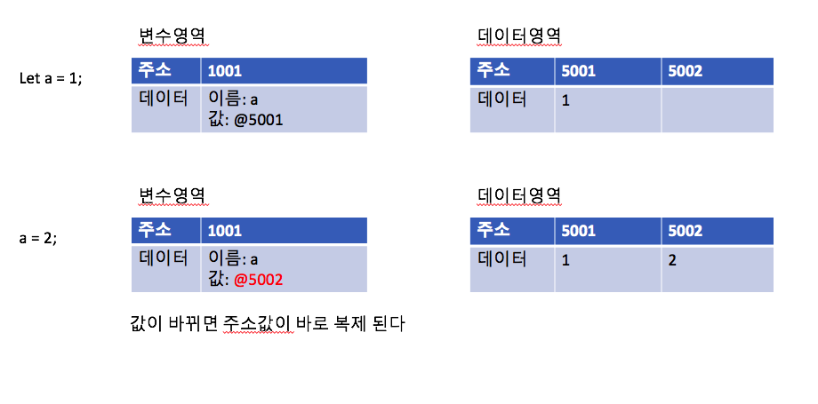
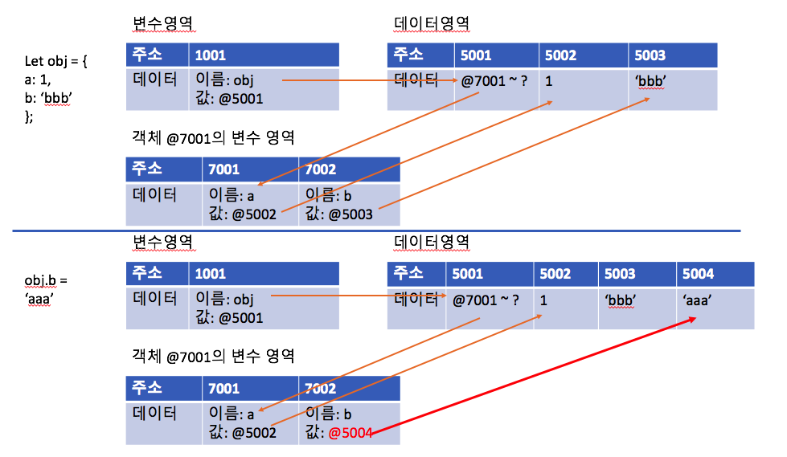
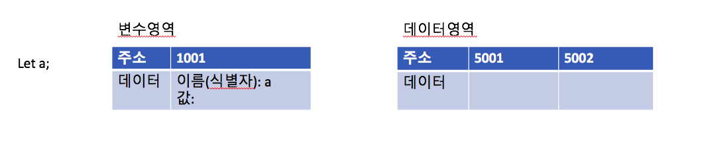
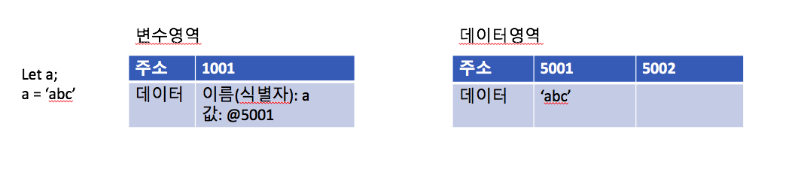
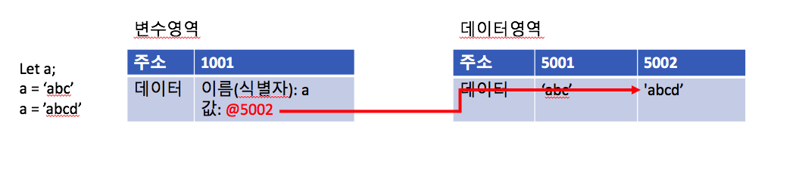
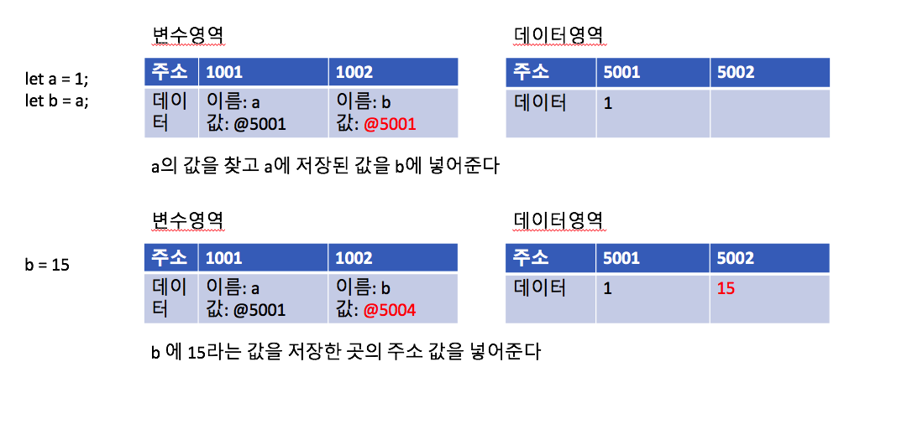
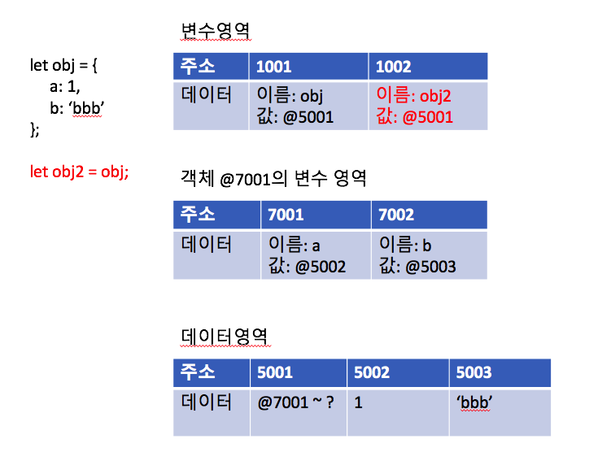

# 데이터 타입
JavaScript가 기본형과 참조형 데이터를 어떻게 처리하는지, 왜 다른지를 알아봅시다. 

## 데이터 타입의 종류
1. <a id="primitive">기본형</a>
    - 숫자(number)
    - 문자열(string)
    - 불리언(boolean)
    - null
    - undefined
    - (es6 추가) [symbol](https://medium.com/sjk5766/es-6-symbol-%EC%9D%B4%EB%9E%80-48c2ad5b054c)

2. 참조형
    - 객체(object)
    - 배열(array)
    - 함수(function)
    - 날짜(date)
    - 정규표현식(RegExp)
    - (es6 추가) Map
    - (es6 추가) WeakMap
    - (es6 추가) Set
    - (es6 추가) WeakSet

- 기본형은 할당이나 연산시 복제되고 참조형은 참조된다라는 말이 있다. 하지만 알고보면 `모두 복제` 된다.

- **그렇다면 차이점은?**
    - 기본형은 값이 담긴 주소값을 바로 복제
      - 기본형은 불변성을 띈다. 새로운 값을 할당하기 위해서 데이터 영역에 새로운 값이 생기고(없는 경우), 변수 영역에 있는 주소값이 변경된다. 
         
        
    - 값이 담긴 주소값들로 이루어진 묶음을 가리키는 주소값을 복제
      - 아래는 참조형의 값을 변경하는 경우 일어나는 일
        - 생성된 객체의 변수 영역에서 가리키는 주소값이 변경된다
        


## 데이터 타입에 관한 배경지식

1. 메모리와 데이터
   - 메모리 용량이 과거보다 월등히 커진 상황에서 나타난 자바스크립트는 상대적으로 메모리 관리에 대해 자유로움
   - 숫자의 경우 정수형, 부동소수형 구분없이 64비트/8바이트를 할당
   - 모든 데이터는 바이트 단위의 식별자(메모리 주소값, Memory address)를 통해 서로 구분하고 연결

2. 식별자와 변수
   - 변수(variable): 변할 수 있는 수, 변할 수 있는 무언가(data)
   - 식별자(identifier): 어떤 데이터를 식별하는데 사용하는 이름, **변수명**
   
## 변수 선언과 데이터 할당
1.  변수 선언
    ```javascript
        let a; 
    ```
    위의 선언은 '변할 수 있는 데이터를 만들겠습니다!!! 이 데이터는 a라는 이름으로 식별하겠습니다!'

    

    이렇게 공간을 하나 차지하게 되는것이 변수 선언 과정

2. 데이터 할당
    * 데이터 할당할때 일어나는 일
        ```javascript
            let a;
            a = 'abc';
        ```

        a라는 이름을 가진 주소를 찾아서, 그곳에 문자열 'abc'를 할당하는 것이 **아니다**

        데이터 저장을 위한 별도의 메모리 공간을 확보하고, 그 주소를 a의 위치에 저장해준다. 

        

        데이터를 할당할때는 아래의 단계가 일어난다. 

        1. 변수 a를 선언하면 a의 공간을 확보한다. (위의 그림에서 주소 1001번)
        2. 1001의 식별자를 a
        3. 'abc'를 넣을 공간을 찾는다. (위의 그림에서 주소 5001)
        4. 식별자 a를 이용해서 이 변수의 위치를 찾는다. 
        5. 해당 위치에 'abc'가 저장된 곳의 주소값을 할당한다. 

    * 이렇게 하는 이유?(왜 변수 영역에 값을 직접 안넣고 한단계를 더해서 머리터지게 하는가?)
        - 자바스크립트는 숫자형 데이터는 8바이트를 확보하지만, 문자열은 규격이 없다. 영어는 1바이트, 한글은 2바이트.. 이런식. 가변적이다. 
        - 미리 확보한 공간 내에서만 데이터를 넣고 바꾸고 그럴수가 있다면, 크기가 안맞는 데이터가 들어오면 데이터 크기에 맞게 공간을 늘리는 작업이 필요할 것 
          - 매우 비효율적이다. n개의 데이터가 저장되어있고 0 <= m <= n 인 위치 m의 데이터의 공간을 늘려야하면 대략 n - m개의 데이터를 다 옮겨야한다. (OH NO!!!)
        - 변수와 데이터를 별도의 공간에 나누어 저장하면 이 문제를 해결 할 수 있다.

        - 데이터에서 변경이 있을때는 아래처럼 동작한다. 
         


## 기본형 데이터와 참조형 데이터
1. 불변값
   - 변수와 상수를 구분하는 성질은 **'변경가능성'**
   - 변수와 상수를 구분할때? _데이터 할당이 이뤄진 변수 공간에 다른 데이터를 재할당 할 수 있는가?_
   - 불변성 여부? 데이터 영역의 메모리

   자바스크립트에서는 5라는 값이 저장되어있는 곳은 가비지 컬렉팅이 되지 않는이상 7이라는 값으로 못바꾼다. 

   즉, [기본형 데이터](#primitive)는 모두 불변값

2. 가변값
    기본형 데이터가 모두 불변이라면, 참조형은 어쩐지 모두 가변값일것 같다! 꼭 그렇진 않다.

    

    기본형 데이터와 차이는 _**객체의 변수(프로퍼티) 영역**_ 이 별도로 존재한다는 것. 

    위의 그림을 봐도 데이터 영역은 여전히 불변이라, 프로퍼티 b에 새로운 값을 넣고 싶을때 데이터 영역에 새로운 공간을 할당 받고, 객체의 변수 영역에서 주소값을 바꾼다. 그래서 슬쩍보면 참조형 데이터는 _불변하지 않은것(가변)_ 으로 보이지만 **데이터 부분은 여전히 불변**이다. 

3. 변수 복사 비교
   - 기본형 데이터의 복사
    

    복사할때 주소값을 복사한다. 

   - 참조형 데이터의 복사
    

    복사하면 obj2 = obj 하면 obj가 가지고 있는 주소값이 obj2에 저장된다. 

    
## 불변 객체
1. 불변 객체를 만드는 법
    - 불변 객체는 React, Vue.js, Angular 등의 라이브러리 및 프레임워크 / 함수형 프로그래밍, 디자인 패턴에서 매우 중요한 개념!

    - _**참조형 데이터의 '가변'은 데이터 자체가 아닌 내부 프로퍼티를 변경할때 성립**_

    - 데이터 자체를 변경하는 경우, 기본형 처럼 기존 데이터는 변하지 않고, 새로운 데이터 할당공간에 값이 생성 후 변수 영역에서 새로운 데이터 공간의 주소값을 가지게 되는 것. 

    - 불변 객체가 필요한 경우? 값으로 전달받은 객체를 변경하더라도 원본은 변하지 않아야하는 경우
        ex) 정보가 바뀐 시점에 알림을 보내야할 때 등. 

2. 얕은 복사와 깊은 복사
    - 얕은 복사는 바로 아래 단계의 값만 복사하는 방법
    - 내부의 모든 값들을 하나하나 찾아서 전부 복사하는 방법
    - 깊은 복사를 하는 방법
      - 객체를 JSON 문법의 문자열로 변환했다가 다시 JSON 객체로 변경
      - [immutable.js](https://immutable-js.github.io/immutable-js/), baobab.js

## undefined와 null

- 자바스크립트에는 없을을 나타내는 값이 두가지: `undefined` 와 `null`
- undefined 인 세가지 경우
  - [1] 값을 대입하지 않은 변수. 즉 데이터 영역의 메모리 주소를 저장하지 않은 식별자에 접근할 때
  - [2] 객체 내부의 존재하지 않는 프로퍼티에 접근하려고 할때
  - [3] return 이 없는 함수의 실행 결과

- null 은 비어있음을 명시적으로 나타내고 싶은 경우
  - typeof null이 object인 버그가 있으므로 주의하기
  - 어떤 변수의 값이 null인지 판별하기 위해서는 typeof외에 다른 방법을 사용해야한다. 
  ```javascript
    let n = null;
    console.log(typeof n); // 결과가 null 이 아니라 object라고 나온다
    console.log(n==undefined); // 결과가 true다
    console.log(n==null); // 결과가 true다

    console.log(n===undefined); // 결과가 false다
    console.log(n===null); // 결과가 true다
  ```


## 정리
- `변수`는 변경 가능한 데이터가 담길 수 있는 공간
- `식별자`는 그 변수의 이름을 말함


### 출처
[코어 자바스크립트](http://www.yes24.com/Product/Goods/78586788) 1장