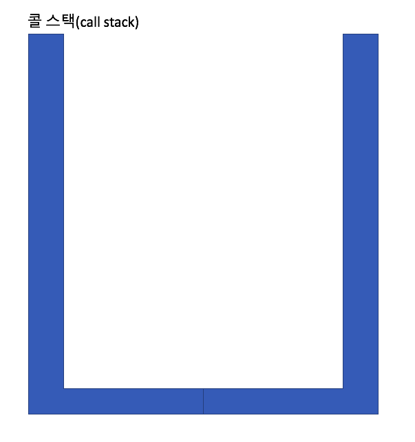
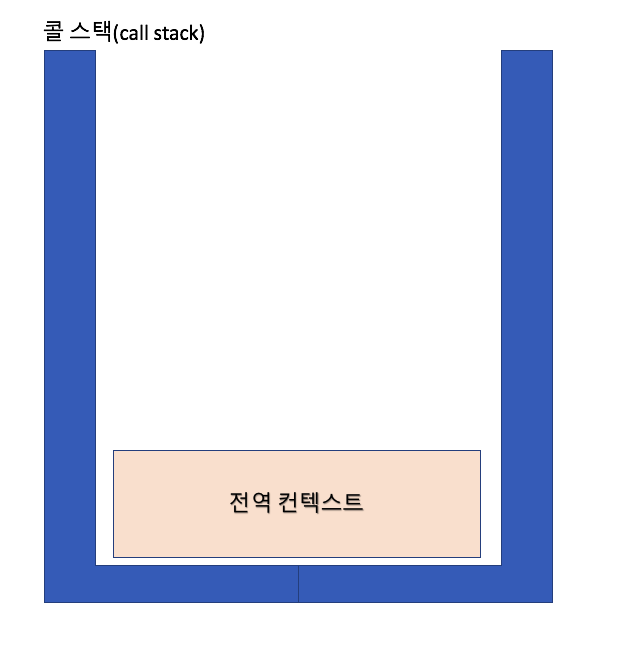
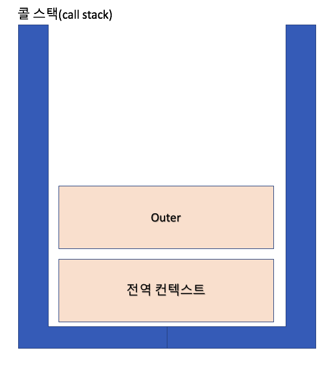
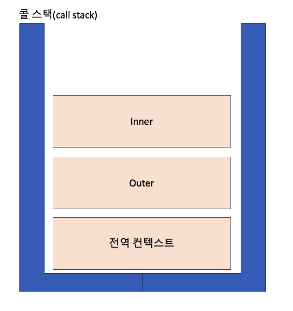
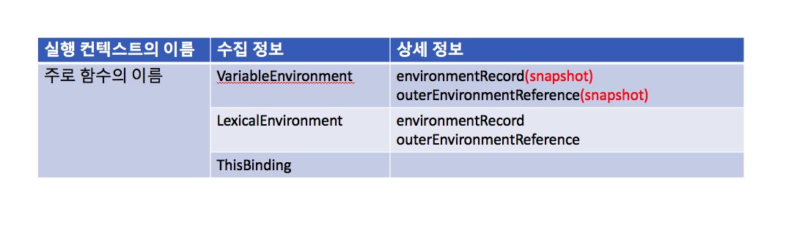

# 실행 컨텍스트(Execution context)

실행 컨텍스트(Execution context)란 실행할 코드에 제공활 한경 정보를 모아놓은 객체.

이 문서에서는 어떤 실행 컨텍스트가 활성화 될때 해당 컨텍스트 내의 변수들을 위로 끌어올리는(개념적으로 그렇단 말!!) 호이스팅(hoisting), 외부 환경 정보 구성, this 값을 설정하는 등의 동작을 다룸 등 다른 언어에서는 없는 특이한 일들을 다룬다. 

실행 컨텍스트는 자바스크립트의 핵심 개념으로 클로저를 사용하는 다른 언어에서도 유사한 개념을 사용하기 때문에 이를 잘 이해하면 개발자로서의 실력향상에 많은 도움이 되니 열심히 이해해봅시다!!


## 실행 컨텍스트란?
- 실행 컨텍스트: **실행할 코드에 제공할 환경 정보들을 모아놓은 객체**
- 자바스크립트는 동일한 환경에 있는 코드들을 실행할때 관련 환경 정보들을 싹싹 모아 컨텍스트를 구성하고, 이를 **콜 스택(Call Stack)** 에 쌓아올려, 가장 위의 컨텍스트들을 실행하며 전체 코드의 환경과 순서를 보장한다. 

- 동일한 환경이 구성되는 단위(실행 컨택스트를 구성할 수 있는 방법):
  - 전역 공간
  - [eval()](https://developer.mozilla.org/ko/docs/Web/JavaScript/Reference/Global_Objects/eval) 함수 -> [코드를 그대로 실행시켜 버리기 때문에 보안에 치명적인 이슈가 발생할 수 있어 사용하지 않음](https://stackoverflow.com/questions/86513/why-is-using-the-javascript-eval-function-a-bad-idea)
  - **함수 -> 가장 흔한 실행 컨텍스트를 구성하는 방법**
  - (es6) 블록 {} 에 의해 생성

- 실행 컨텍스트와 콜스택 도식
    ```javascript
        let a = 1;                  // 1
        function outer() {          // 2
            function inner() {      // 3
                 console.log(a);    // 4
                 let a = 3;         // 5
            }                       // 6
            inner();                // 7
            console.log(a);         // 8
        }                           // 9
        outer();                    // 10
        console.log(a);             // 11
    ```

    1. 처음엔 콜스택에 뭐 암것두 없다. 
        
         


    2. 처음 자바스크립트 코드를 실행할때 전역 컨텍스트가 콜스택에 담긴다. 일반 실행 컨텍스트와 다른 것은 없다. 
        `최상단 공간은 별도 실행 명령없이 브라우저가 자동으로 실행하므로 자바스크립트 파일이 열리면 바로 전역컨텍스트가 활성화 되는것으로 이해하기!`

         

    
    3. 코드를 줄줄 읽어보다가 함수가 실행되는 **line 10 에서 자바스크립트 엔진이 outer의 실행컨텍스트**를 구성하고 콜스택에 넣는다. 
        
         

        이렇게 outer가 콜스택의 최상단에 올라오면 전역 컨텍스트와 관련되서 실행하던 것을 멈추고, outer의 코드를 실행한다. 

    4. outer함수를 실행하다보면 **line 7 에서 inner함수를 만나면 inner함수의 실행 컨텍스트가 콜스택에 담기고**, outer 컨텍스트의 코드가 중단되고, inner를 실행한다. 
        
         


    5. inner함수의 실행이 끝나면 inner 실행 컨텍스트가 콜스택에서 제거된다. 그리고 그다음 최상단인 outer 실행 컨텍스트로 돌아가서 마저 실행한다. 
        
         

    6. outer함수의 실행이 끝나면 outer 실행 컨텍스트가 콜스택에서 제거되고, 콜스택에 전역컨텍스트만 남는다. 
        
         


    7. 전역 컨택스트도 마저 실행하고 콜스택에는 아무것도 남지 않게 된다. 
        
         


- 실행 컨텍스트에 저장되는 내용?
  - 실행 컨텍스트가 쌓일때 자바스크립트 엔진은 해당 컨텍스틀에 관련된 환경 정보를 수집해서 실행 컨텍스트 객체에 저장
  - 엔진이 활용하는 내용이라 개발자가 코드를 통해서 건드릴 수는 없다. 
  - 아래는 실행 컨텍스트 객체에 저장되는 내용이다

     


## VariableEnvironment

VariableEnvironment 의 내용은 LexicalEnvironment와 같지만 snapshot이므로 자바스크립트 엔진은 VariableEnvironment에 처음 정보를 넣고, 이를 복사해서 LexicalEnvironment을 만들고 이것을 주로 활용하게 된다. 


## LexicalEnvironment

- lexical enviroment: 사전적 환경(코어 자바스크립트 책에서 사용하는 의미), 어휘적 환경/정적 환경(사람들이 많이 사용하는 언어)

1. environmentRecord와 호이스팅
    - environmentRecord에는 해당 실행 컨텍스트와 관련된 코드의 식별자 정보 저장
    - 매개변수 식별자, 선언한 함수 자체, 선언된 변수의 식별자
    - 컨텍스트를 쭈욱 훑으면서 순서대로 수집
    - 코드가 실행되기 전에 변수 정보를 수집하는 과정을 마친다. **그래서 코드 실행전에 자바스크립트 엔진은 해당환경의 모든 변수명을 알게된다!**
    - _**이 과정이 마치 자바스크립트 엔진이 변수를 최상단으로 다 끌어올리는 것 같아 hoisting(끌어올리다)로 부른다**_


2. 스코프, 스코프 체인, outerEnvironmentReference
    - scope: 식별자에 대한 유효범위
    - 스코프 체인(scope chain): 식별자의 유효범위를 안에서부터 바깥으로 차례로 검색해나가는 것
      - LexicalEnvironment의 두번째 수집자료 `outerEnvironmentReference` 를 이용해서 수행
      - `outerEnvironmentReference` 는 현재 _**호출된 함수가 선언될 당시**_의 LexicalEnvironment를 참조
      - 스코프 체인에서 가장 먼저 발견된 식별자에만 접근가능함


## this

- thisBinding에는 this로 저장된 객체, 아무것도 지정이 안되면 전역객체가 저장된다

## 정리

- 실행 컨텍스트는 실행할 코드에 제공할 환경 종보를 모아놓은 객체
- VariableEnvironment와 LexicalEnvironment는 시작할때는 같은 내용인데, 실행하다보면 LexicalEnvironment는 변한다. 
- 호이스팅(hoisting) environmentRecord의 수집과정을 추상화
- 스코프: 변수의 유효범위
- 전역변수: 전역컨텍스트의 LexicalEnvironment에 담긴 변수

### 출처
[코어 자바스크립트](http://www.yes24.com/Product/Goods/78586788) 2장
