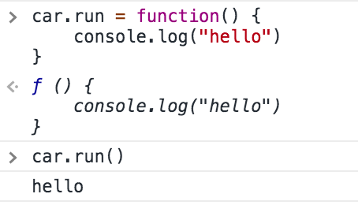
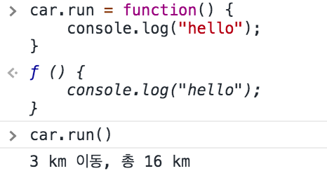

# 클로저 (Closure)

- `A closure is the combination of a function and the lexical environment within which that function was declared`

- 어떤 함수 `outer`내에 선언한 `inner`라는 함수에서 `outer`에 있는 변수를 참조하게 해놓고, `inner`함수는 외부로 전달해서 할 수 있다. 이때 `inner`함수가 outerEnvironmentReference가 이미 종료된 `outer`의 LexicalEnvironment를 참조하기 때문에 이 LexicalEnvironment의 environmentRecord에 `inner`함수가 참조하는 식별자가 가비지 컬렉팅 되지 않고 남아있는 현상을 말한다. 

- JavaScript에만 한정되는 내용이 아니라 ECMAScript에서도 클로저의 정의는 포함하지 않고있다. 

## 클로저와 메모리 관리

- 클로저는 개발자의 의도에 따라 함수의 지역변수가 사라지지 않도록 해서 발생. 
- 필요성이 사라지면 메모리를 소모하지 않도록 null 이나 undefined를 할당

- 코드 예제
    ```javascript
    let outer = (() => {
        let a = 1;
        let inner = () => {
            return ++a;
        }
        return inner;
    })(); // 1 inner 함수 반환

    console.log(outer());
    console.log(outer());

    outer = null; // 2 
    ```
    - outer 식별자가 반환한 inner 함수가 아니라 null, undefined값을 가지도록해서 참조를 끊고 가비지 컬렉팅 될 수 있도록 한다. 

## 클로저 예제

- 접근 권한 제어(정보 은닉)
    - 정보 은닉(information hiding)이란?
      - 모듈 내부 로직에 대해 외부 노출을 최소하해서 모듈간의 결합도를 낮추고자 하는 현대 프로그래밍의 중요한 개념
      - public, private, protected 가 있음
      - JavaScript에는 변수 자체에 해당 접근 권한을 부여할 수 없지만 `클로저를 통해서 함수내에서 public / priviate 값을 구분할 수 있다`
      - return 한 변수는 `public`, 아닌 변수는 `private`


    - 예제: 자동차 게임에 접근 권한 제어가 필요한 이유
        1. 정보은닉이 적용 안됬을때
            ```javascript
            let car = {
                fuel: Math.ceil(Math.random() * 10 + 10),
                power: Math.ceil(Math.random() * 3 + 2),
                moved: 0,
                run: function() {
                    let km = Math.ceil(Math.random() * 6);
                    let wasteFuel = km / this.power;
                    if(this.fuel < wasteFuel){
                        console.log("연료가 모자람");
                        return;
                    }
                    this.fuel -= wasteFuel;
                    this.moved += km;
                    console.log(`${km} km 이동, 총 ${this.moved} km`)
                }
            }
            ```

            위의 객체는 car.run()으로 자동차가 이동할 수 있지만, 사용자가 임의로 `car.fuel = '임의의 값'` 으로 설정할 수 있다. 하지만 우리는 사용자가 이렇게 접근하지 못하도록 하고 싶다. 이때 클로저를 활용할 수 있다. 
        
        2. 클로저를 적용해서 fuel, power, moved는 사용자가 접근 할 수 없도록 하기
            ```javascript

            let createCar = function() {
                let fuel = Math.ceil(Math.random() * 10 + 10);
                let power = Math.ceil(Math.random() * 3 + 2);
                let moved = 0;

                // 접근 권한을 주고 싶은 것만 반환함
                return {
                    get moved(){
                        return moved;
                    },
                    run: function() {
                        let km = Math.ceil(Math.random() * 6);
                        let wasteFuel = km / power;
                        if(fuel < wasteFuel){
                            console.log("연료가 모자람");
                            return;
                        }
                        fuel -= wasteFuel;
                        moved += km;
                        console.log(`${km} km 이동, 총 ${moved} km`)
                    }
                }
            }
            let car = createCar();
            car.run()
            ```

            이를 통해 car.fuel = 1000 등의 동작을 할 수 없도록 했다. 하지만 여전히 car.run 의 값은 다른 값으로 덮어 씌울수 있다.

            

            위의 그림처럼 다른 함수로 덮어쓰기 할수가 있다. 

        3. car.run 조차도 다른 값으로 못바꾸도록 만들기
            ```javascript
                let createCar = function() {
                    let fuel = Math.ceil(Math.random() * 10 + 10);
                    let power = Math.ceil(Math.random() * 3 + 2);
                    let moved = 0;

                    // object.freeze로 고정시키기
                    let publicMembers = {
                        get moved(){
                            return moved;
                        },
                        run: function() {
                            let km = Math.ceil(Math.random() * 6);
                            let wasteFuel = km / power;
                            if(fuel < wasteFuel){
                                console.log("연료가 모자람");
                                return;
                            }
                            fuel -= wasteFuel;
                            moved += km;
                            console.log(`${km} km 이동, 총 ${moved} km`)
                        }
                    }

                    Object.freeze(publicMembers);
                    return publicMembers;
                }
                let car = createCar();
                car.run()
            ```

            

            이제 car.run 도 덮어쓰기가 안된다. 

- 커링 함수
  - 커링함수(currying function)이란? 
    - 여러개의 인자를 받는 함수를 하나의 인자를 받는 함수로 구성해서 순차적으로 호출할 수 있도록 구성한 것
    - 중간 과정에 있는 함수는 그다음 인자를 받기 위해 대기한 후 마지막 인자가 와야 최종 목표였던 함수를 실행
    - 예시
        ```javascript
        let curryingFunc = function(func) {
            return function(a){
                console.log("1. ", a);
                return function(b){
                    console.log("2. ", b);
                    return function(c){
                        console.log("3. ", c);
                        return function(d){
                            console.log("4. ", d);
                            return function(e){
                                console.log("5. ", e);
                                return func(a, b, c, d, e);
                            }
                        }
                    }
                }
            }
        }

        let getMax = curryingFunc(Math.max);
        console.log(getMax(1)(2)(3)(4)(5));
        ```

        이렇게 인자를 따로따로 받을 수 있다. 위의 함수는 더 짧게 구성할 수 있다. 

        ```javascript
            let curryingFunc = func => a => b => c => d => e => func(a, b, c, d, e);
        ```

        이처러 구성하면 커링함수를 더 쉽게 이해할 수 있다. 
    - 커링함수에서 각 단계에서 전달한 인자들은 마지막 함수에서 참조하기 때문에, 클로저의 성질때문에 가비지 컬렉팅 되지 않고 메모리에 계속 남아있게 된다. 이후 마지막 함수에서 실행이 완료되고 실행 컨텍스트가 종료되면 가비지 컬렉팅의 대상이 된다. 

## 정리

클로저는 본질적으로 실행 컨텍스트가 종료된 후에도 다른곳에서 해당 실행컨텍스트의 식별자를 참조해서 그 값이 메모리를 계속 차지하는 것이라 메모리와 밀접한 관련이 있다. 이때문에 사용하지 않는 클로저에 대해서는 null, undefined 등으로 메모리를 차지않도록 해제 해줘야한다. 

### 용어 다시 정리
- Lexical Environment란? 
  - 현재 컨텍스트에서 사용되는 변수 등의 식별자에 대한 정보가 EnvironmentRecord에 기록
  - EnvironmentRecord에 없는 내용은 outerEnvironmentReference를 찾아가라는 뜻
  
### 출처
[코어 자바스크립트](http://www.yes24.com/Product/Goods/78586788) 5장