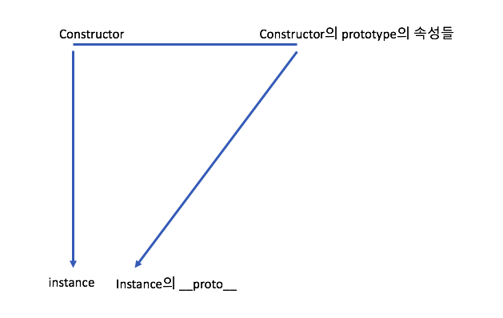
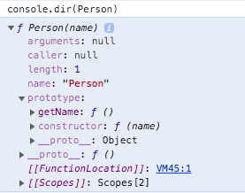
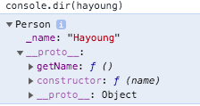

# 프로토타입 (Prototype)
 
- JavaScript는 `프로토타입` 기반 언어이다. 클래스 기반에서는 상속이라는 개념을 사용하지만, JavaScript에서는 원형객체(프로토타입)을 복제(참조) 해서 상속의 효과를 얻는다. 
- 이것만 잘 이해해도 숙련자 레벨이라고 하니, 어려워도 이해해보자!

## 프로토타입이란?

- 객체를 생성할때 일어나는 일
    
    ```javascript
        let instance = new Constructor();
    ```

    1. 어떤 생성자 함수가 있다. 그리고 이 생성자 함수는 prototype 속성이 있다(없을수도 있다)
    2. 이 생성자 함수를 new 연산자와 함께 호출한다. 
    3. Constructor에 정의된 내용으로 인스턴스(새로운 객체)가 생긴다. 
    4. 이러한 인스턴스는 `__proto__` 속성이 부여된다. 
    5. 인스턴스의 `__proto__` 는 Constructor의 prototype 속성을 참조한다. 

    * 도식화: 위의 절차를 도식화 하면 아래와 같다. 
    

    * 예제:     
        ```javascript
        let Person = function(name){
            this._name = name;
        }
        Person.prototype.getName = function(){
            return this._name
        }
        let hayoung = new Person("Hayoung");
        hayoung.__proto__.getName(); // 1 결과: undefined
        hayoung.getName() // 2 결과: Hayoung
        ```
        - 1번째 줄에서 결과가 undefiend인 것은 이 경우 this 가 `hayoung.__proto__` 이기 때문
        - 2번째 줄에서 `__proto__` 는 __**생략 가능**__하기 떄문에 hayoung.getName()을 통해서는 this 가 hayoung이기 때문에 제대로된 결과가 출력된다. 
        - Person 생성자의 속성:
            
            

        - hayoung 인스터의 속성:

            
        
    * 프로토타입의 개념 정리
        * JavaScript는 함수에 자동으로 prototype이라는 속성을 설정함
        * 이런 함수를 new 연산자와 함께 생성자 함수로 사용하는 경우, 새로 생성된 인스턴스에 `__proto__` 속성이 생기고, 이건 생성자 함수의 prototype을 참조한다
        * 생성자 함수의 prototype에 어떤 속성 및 메소드가 있으면 인스턴스에서도 `__proto__`을 통해 생성자 함수의 prototype을 참조해서 사용할 수 있다
        * 이때 함수에 자동으로 생긴 prototype에는 constructor 속성이 있고, 여기는 자기 자신에 대한 정보가 있다. 인스턴스에서도 `__proto__`를 통해 자신의 constructor를 참조 할 수 있다. 


## 프로토타입체인이란?

- 메서드 오버라이드란?
  - `instance.__proto__` 에서 `__proto__` 를 생략하고 prototype의 내용을 참조할 수 있는데, 인스턴스에 동일한 이름의 프로퍼티나 메서드가 있다면 오버라이드가 된다. 
  - 예제
     ```javascript
        let Person = function(name){
            this._name = name;
        }
        Person.prototype.getName = function(){
            return this._name
        }
        let hayoung = new Person("Hayoung");
        hayoung.getName = function() { // 1
            return "인스턴스: " + this._name;
        }

        console.log(hayoung.getName()) // 2 결과: "인스턴스: hayoung"
        console.log(hayoung.__proto__.getName()) // 3 결과: undefined
        console.log(hayoung.__proto__.getName.call(hayoung)) // 4 결과: hayoung
    ```
    - 1번째 줄에서 hayoung.getName에 새로운 함수를 정의하면 `hayoung.__proto__`의 getName이 아니라 hayoung 인스턴스의 `getName`에 접근한다
    - JavaScript 엔진은 가장가까운 자신의 프로퍼티를 검색하고, 없으면 `__proto__`에서 내용을 찾는다. 
    - 이제 prototype 메소드를 접근하고 싶을때, 3번째 줄에서는 결과가 undefined라고 나온다. 이때 this를 다시 hayoung 인스턴스를 바라보게 하려면 4번째 줄에서처럼 call, apply, bind를 적용할 수 있다. 

- 프로토타입 체이닝(prototype chaining)이란?
  - 프로토타입 체인이란 `__proto__`프로퍼티가 연쇄적으로 이어진것
  - 이 체인을 따라가면서 검색하는것을 프로토타입 체이닝
  - 모든 객체는 프로토타입 체이닝을 따라가다가 최상단에 도착하면 `Object.prototype`이 존재한다
  - 예외로 Object.create로 생성한 함수는 `__proto__`가 없는 객체를 생성해서 프로토타입 체인을 따라갔을때 `Object.prototype`가 없을 수 있다

    
### 출처
[코어 자바스크립트](http://www.yes24.com/Product/Goods/78586788) 6장