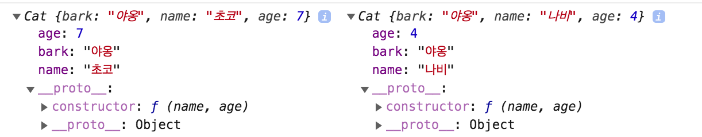

# this

많은 객체지향 언어에서는 `this`를 클래스에서만 사용하기 때문에, 우리가 예상하는대로 동작한다. 즉, Java와 같은 객체지향 언어에서는 this란 클래스로 생성한 인스턴스를 가리킨다. 하지만 JavaScript는 함수와 객체(메서드)의 구분이 느슨하고, `this`를 어디서든 사용할 수 있기 때문에, 상황에 따라 `this`가 달라져서 우리가 원하지 않는 동작을 할 가능성도 있다.

## 상황에 따라 달라지는 this

JavaScript에서 함수를 호출할 때, 즉 실행 컨텍스트가 생성될때 `this`가 결정된다. 그리고 이와 같은 특성 때문에 함수를 **`어떻게`** 호출하는지에 따라 `this`가 달라지는 것이다. 

- 전역 공간에서의 this
  - 전역 공간에서 this는 전역 객체로, 브라우저 환경에서는 `window`, Node.js 환경에서는 `global`이다. 

- 메서드로 호출할 때 메서드 내의 this
  - 함수를 실행하는 일반적인 방법 두가지: 메서드로 호출하기 또는 함수로 호출하기
    - 두가지 방법을 구분하는 차이는 `독립성`
    - 메서드는 자신을 호출한 대상 객체에 대한 동작 수행
    - 함수는 그 자체로 독립적인 기능 수행
    - JavaScript에서는 객체의 메서드로 호출하면 메서드로 동작하고, 함수로 호출하면 함수가 된다. 
    - 함수앞에 `.` 이 있는가로 쉽게 구분할 수 있다. `.`이 있으면 메소드, 없으면 함수

    ```javascript
    let func = function(x) {
        console.log(this, x); // 결과 Window{...} 1;
    };
    func(1);

    let obj = {
        method: func
    }

    obj.method(2); // { method: f} 2
    obj['method'](2); // { method: f} 2
    ```
  

- 함수로서 호출할 때 함수 내의 this
  - 함수로 호출할때는 this가 지정되지 않으므로 함수내에서 `this`는 전역객체이다. 
  - __**메서드 내부함수에서의 this**__
    - 내부함수를 함수로서 호출했는지, 메서드로 호출했는지 파악을 통해 this 값을 예상할 수 있다. 

    ```javascript
    let obj1 = {
        outer: function() {
            console.log(this); // 1

            let innerFunc = function () {
                console.log(this); // 2
            }

            innerFunc(); // 3

            let obj2 = {
                innerMethod: innerFunc
            };

            obj2.innerMethod(); // 4
        }
    }

    obj1.outer(); // 5
    ```
    1. 5번째 줄에서 obj1.outer() 을 호출하면 메서드로 호출했기 때문에 1번째 줄의 결과값은 `obj1` 이다. 
    2. 3번째 줄에서 innerFunc()를 함수로서 호출하면 this가 지정되지 않기 때문에 2번째 줄의 결과값은 `window 객체`이다. 
    3. 4번째 줄에서 obj2.innerMethod()를 호출하면 메서드로 호출했기 때문에 2번째 줄의 결과값은 `obj2` 이다. 

    - 위의 방식의 문제점: 3번째 줄 실행 결과가 어색하다. 호출객체가 없을때 전역객체를 바인딩하지 않고, 호출 당시 주변 환경의 this를 상속 받는 것이 더 자연스러운 동작. 
      - 해결 방법 1: ES5에서 화살표 함수가 없을때
        ```javascript
        let obj1 = {
            outer: function() {
                console.log(this); // 1

                let self = this; // 2
                let innerFunc = function () {
                    console.log(self); // 3
                }

                innerFunc(); // 4

                let obj2 = {
                    innerMethod: innerFunc
                };

                obj2.innerMethod(); // 5
            }
        }

        obj1.outer(); // 6
        ```
        1. 2번째 줄에서 `let self = this`를 통해 this의 값을 지정.
        2. 4번째 줄에서 innerFunc()를 실행하면 this가 아니라, self에 담겨있던 주변환경의 this가 출력
        3. 5번째 줄에서 obj2.innerMethod()를 실행해도 self에 담겨있던 주변환경의 this가 출력

      - 해결 방법 2: ES6 이후로 화살표 함수가 등장했을 때
        - [화살표 함수](https://poiemaweb.com/es6-arrow-function)는 함수 내부에서 this가 전역객체를 바라보는 문제를 보완함. 따라서 화살표 함수를 사용하면 this를 자동으로 바인딩하지 않음.
        ```javascript
        let obj1 = {
            outer: function() {
                console.log(this); // 1

                let innerFunc = () => {
                    console.log(this); // 2
                }

                innerFunc(); // 3
            }
        }
        ```
        1. innerFunc를 화살표 함수로 변경
        2. 3번째 줄에서 innerFunc를 호출하면 **화살표 함수이기때문에 전역객체를 바인딩 하지 않음**
        3. innerFunc내의 this는 주변환경의 this를 그대로 상속 받고, 2번째 줄의 결과로 { outer: f } 를 출력

- [콜백 함수](./callback) 호출 시 함수 내의 this
  - 콜백함수도 함수이기때문에 기본적으로 this가 전역객체를 참조하지만, 콜백 함수를 받는 함수에서 콜백함수에 this가 될 대상을 지정할 수 있음
  - 콜백함수 예시
  ```javascript
    setTimeout(function() { 
        console.log(this); // 1
    }, 300)
  ```
  setTimeout이라는 함수는 `function() { console.log(this);}`를 전달받고 이에 대한 제어권을 가지게 된다. 
  이때 setTimeout은 함수 내부에서 콜백함수의 대상이 될 this를 지정하지 않기때문에, 1번째 줄의 결과는 전역객체이다. 
  - 콜백함수 내에서 this는 상황에 따라 다름

- 생성자 함수 내부의 this
  - JavaScript는 함수에 생성자 역할도 부여해서, `new` 명령어와 함께 함수를 호출하면 해당 함수가 생성자로 동작함
  - 생성자 함수 내에서 예시
  ```javascript
  let Cat = function (name, age){
      this.bark = '야옹';
      this.name = name;
      this.age = age;
  }
  let choco = new Cat('초코', 7);
  let navi = new Cat('나비', 4);
  console.log(choco, navi);
  ```

  

  - 생성자 함수 내에서 this는 해당 객체를 의미함. 이를 통해서 해당객체에 속성을 할당할 수 있음


## 명시적으로 this를 바인딩하는 방법

- [call 메서드](https://developer.mozilla.org/en-US/docs/Web/JavaScript/Reference/Global_Objects/Function/call)
  - call 함수를 통해서 임의의 객체를 this로 지정하는 방법
  ```javascript
  let func = function(a, b, c){
    console.log(this, a, b, c); // 1
  }

  func(1,2,3); // 2
  func.call({x: 1}, 4, 5, 6); // 3
  ```
  - 2번째 줄의 결과는 this가 전역객체이다. 결과로 `Window{...} 1 2 3`
  - 하지만 3번쨰 줄에서 call을 통해서 첫번째 인자로 this로 지정할 객체를 넘겨 줄 수 있다. 이때 1번째 줄의 결과는 `{ x: 1} 4 5 6` 


- [apply 메서드](https://developer.mozilla.org/en-US/docs/Web/JavaScript/Reference/Global_Objects/Function/apply)
  - apply 함수와 call 함수는 기능적으로 완전히 동일
  - 차이점은 arguments를 __**배열로 넘겨준다는 것**__
  ```javascript
  let func = function(a, b, c){
    console.log(this, a, b, c); // 1
  }

  func.apply({x: 1}, [4, 5, 6]); // 2
  ```
  - 2번째 줄에서 apply 함수를 통해 통해서 첫번째 인자로 this로 지정할 객체를 넘겨 준다. 그외의 arguments를 배열로 넘겨준다. 이때 1번째 줄의 결과는 `{ x: 1} 4 5 6` 


- [bind 메서드](https://developer.mozilla.org/en-US/docs/Web/JavaScript/Reference/Global_objects/Function/bind)
  - ES5에서 추가됨
  - call/apply와 유사하나, 즉시 호출하지 않고, 넘겨받은 this를 기반으로 새로운 함수를 반환
  ```javascript
  let func = function(a, b, c){
    console.log(this, a, b, c); // 1
  }

  let bindFunc = func.bind({x: 1}); // 2
  bindFunc(4,5,6); // 3
  ```
  - 2번째 줄에서 bind 함수를 통해 {x: 1}이 this로 바인드된 새로운 함수를 반환해준다. 이를 이용해서 bindFunc 함수에 인자를 넘기고 실행하면 1번째 줄의 결과는 `{ x: 1} 4 5 6` 


### 출처
[코어 자바스크립트](http://www.yes24.com/Product/Goods/78586788) 3장
